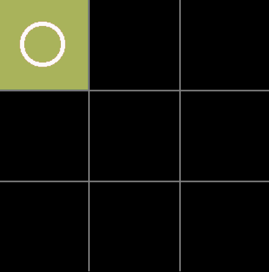

# Tic-Tac-Toe AI with Minimax

A small Python project that combines **game theory**, **minimax search**, and a **matplotlib-based interactive board** to create an unbeatable Tic-Tac-Toe opponent.

> This repository was built as a learning project to explore adversarial search, clean game logic, and simple interactive UI design in Python.

## Preview



## Features

- Unbeatable AI based on the **minimax algorithm**
- Interactive visual game board using **matplotlib**
- Clean separation between **game logic** and **UI rendering**
- Unit tests for core AI logic and board behavior

## Tech Stack

- Python
- NumPy
- Matplotlib
- Pytest

## Project Structure

```text
.
├── GTO_TTT.py                 # Minimax / game-theory AI engine
├── Interactive_Board.py       # Interactive board rendering and controls
├── main.py                    # App entry point
├── requirements.txt           # Dependencies
├── pytest.ini                 # Pytest configuration
└── testing/
    ├── test_gto_ttt.py
    └── test_interactive_board.py
```

## How It Works

The AI evaluates possible future board states recursively using minimax:

- the **human** tries to maximize the score
- the **AI** tries to minimize the score
- terminal states are scored as win, loss, or draw
- memoization is used to cache already-solved positions

Because Tic-Tac-Toe has a small search space, the AI can play optimally every turn.

## Installation

```bash
pip install -r requirements.txt
```

## Run the Project

```bash
python main.py
```

When the game starts, you can choose whether to go first.

## Controls

- **Arrow keys** → move the selection
- **Enter** → place your move

## Run Tests

```bash
pytest -v
```

## What I Learned

This project helped me practice:

- recursive decision-making with minimax
- state evaluation in turn-based games
- separating UI concerns from domain logic
- writing tests for both logic and interactive components

## Possible Next Improvements

- improved visuals and animations
- GitHub Actions test workflow
- implement random moves of AI agent for equal game states
- implement configurable difficulty
- building an alternative AI agent trained through reinforcement learning 


## License

MIT
